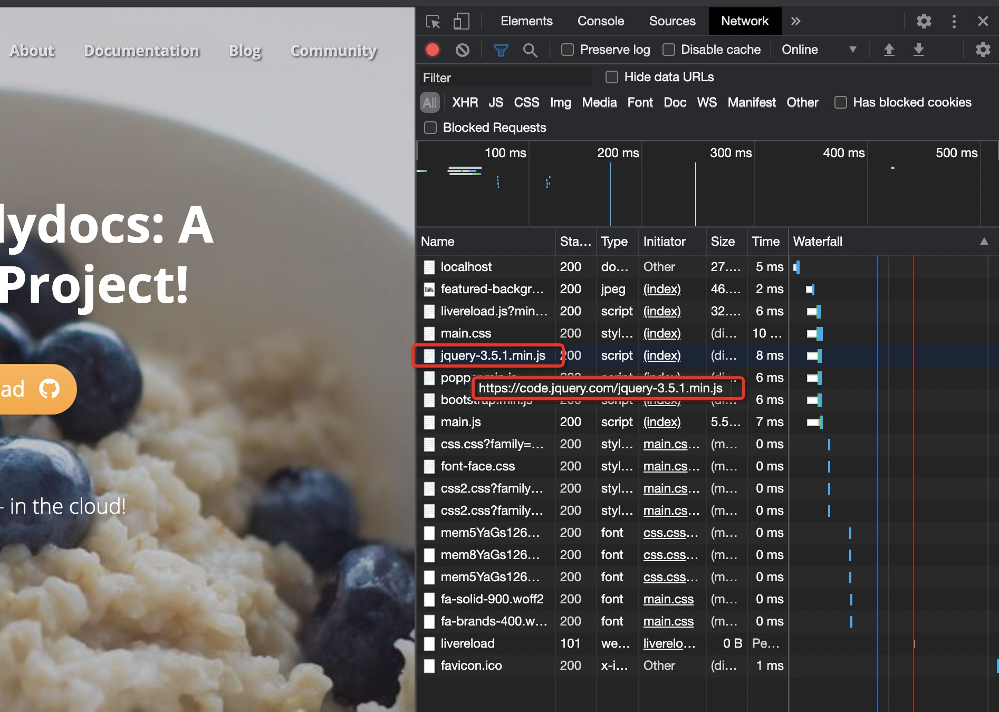

{}
在国内网络环境的实际情况下，静态文件的装载速度非常慢，有些甚至被墙，导致页面访问困难，此时需要做本地化
{}

### 静态文件本地化的背景

在docsy模版中，大量使用 css/js 等静态文件，这些文件很多是直接使用url链接访问的，比如：

```
https://cdn.jsdelivr.net/gh/rastikerdar/vazir-font@v27.0.1/dist/font-face.css
https://cse.google.com/cse.js
https://code.jquery.com/jquery-3.5.1.min.js
https://unpkg.com/lunr@2.3.8/lunr.min.js
https://cdnjs.cloudflare.com/ajax/libs/popper.js/1.14.3/umd/popper.min.js
https://stackpath.bootstrapcdn.com/bootstrap/4.1.3/js/bootstrap.min.js
https://cdn.jsdelivr.net/npm/mermaid@8.8.1/dist/mermaid.min.js
```

在国内网络环境的实际情况下，这些文件下载的速度非常慢，有些甚至被墙，导致我们网站页面在不科学上网的情况下速度很慢，甚至打不开。

解决的方法就是将这些静态文件"本地化":

- 将静态文件下载下来作为网站内容的一部分发布
- 修改文件地址指向本地文件

具体做法如下：

### 步骤一：找出网络访问的文件

打开浏览器的开发工具，如chrome的"开发者工具"，然后访问使用docsy的页面。

在network下可以看到访问的文件列表：



### 步骤二：下载到docsy static目录下

将这些文件下来下来，存放到 docsy 模版项目根目录下的 `static/local` 目录下，以文件 `https://stackpath.bootstrapcdn.com/bootstrap/4.1.3/js/bootstrap.min.js` 为例：

```bash
mkdir local
cd local
wget -x https://stackpath.bootstrapcdn.com/bootstrap/4.1.3/js/bootstrap.min.js
```

`wget -x ` 会在local目录下建立和url中路径一模一样的多层目录， 上面的命令执行完成之后，文件就被下载并保存为`docsy/static/local/stackpath.bootstrapcdn.com/bootstrap/4.1.3/js/bootstrap.min.js`。

将发现的网络文件安装上面的方式逐个下载并保存到 `static/local` 目录下。

### 步骤三：修改文件路径指向本地化文件

需要找出来是哪些文件中存在这样的网络路径，可以在根目录下执行查找命令来看到底是哪个文件引用了网络地址文件 ``https://stackpath.bootstrapcdn.com/bootstrap/4.1.3/js/bootstrap.min.js``：

```bash
cd docsy/layout
find . -type f -exec grep -Hn 'bootstrap.min.js' {} \;

./partials/scripts.html:3:<script src="https://stackpath.bootstrapcdn.com/bootstrap/4.1.3/js/bootstrap.min.js" integrity="sha384-ChfqqxuZUCnJSK3+MXmPNIyE6ZbWh2IMqE241rYiqJxyMiZ6OW/JmZQ5stwEULTy" crossorigin="anonymous"></script>
```

然后我们打开这个文件，将路径`https://` 修改为 `/local/` 就可以了。这样 `bootstrap.min.js` 文件最终的网络访问地址会是 `https:/localhost:1313/local/stackpath.bootstrapcdn.com/bootstrap/4.1.3/js/bootstrap.min.js`。

修改的文件比较多，有兴趣同样操作的同学可以参考我的这次修改记录：

https://github.com/skyao/docsy/commit/70f0f413b0da4545eb3ae9f1d63d52edaae9ba78

> 备注： Google CSE 相关的文件不能本地化，否则会在使用时报错 `Unauthorized access to internal API`。上面的文件列表后来和cse相关的改动都回滚了。

### 优化总结

静态文件经过本地化优化之后，网站访问速度会有质的提升。

比较头疼的是，每次升级主题版本，都会有大量的静态文件变化，通常是更新版本，因此不得不将上面的优化工作再执行一次。

### 特别补充：以子目录发布

上述优化完成后，一般情况都没有问题，但是有一种情况，即当前项目并不是作为站点的根目录发布，而是放在某个站点的子目录下时，就会出现问题。

典型如我用 docsy 做学习笔记，几十份学习笔记不可能每个都开一个网站，即使是用子域名也难于维护。因此我用了最简单的方式：每个学习笔记单独存放在一个独立的子目录下。

此时在nginx下发布时需要指定 baseUrl，比如 `/var/www/skyao/` 目录下存放的是我的技术博客的内容，访问地址是 `https://skyao.io`，那么现在这份hugo学习笔记的发布的地址就是 `/var/www/skyao/learning-hugo` ，而访问地址则是 `https://skyao.io/learning-hugo/`。下面是构建脚本示意：

```bash
rm -rf public
hugo --baseUrl="https://skyao.io/learning-hugo/"

rm -rf /var/www/skyao/learning-hugo
cp -r public /var/www/skyao/learning-hugo
```

这种以子目录形式发布内容，在实践中会遇到问题，关键在于： "/" 这个根目录绝对路径的使用。在 `baseUrl="https://skyao.io/learning-hugo"` ，`/`目录会表示为 `https://skyao.io/`，而不是 `https://skyao.io/learning-hugo` ，导致很多路径失效。

通过chrome的开发者工具，查看网络访问时就能看到，本来以 `/` 开头预期访问地址是 `https://skyao.io/learning-hugo/local/***`的文件，因为地址被理解为 `https://skyao.io/local/***` 而报错404。

解决的方式之一是修改 config.toml 文件，加入以下配置:

```bash
# 之前已经配置了 uglyurls = true
uglyurls = true 
# 现在要加入的新配置
relativeURLs = true
```

hugo官网对 `relativeURLs`参数的解释是：启用后可使所有使用相对路径的URL修改为相对于内容根（content root）。请注意，这不会影响使用绝对路径的URL。

但这个方式并不完美：在某些环节会出现其他的问题，比如我遇到的这个问题： https://github.com/google/docsy/issues/422 。

也有其他方案，比如设置 canonifyurls = true，但也同样会触发类似的问题：https://github.com/google/docsy/issues/350 。

折腾了一圈，发现没有完美的办法。而且，还有一个地方是绝对无解的：有些url是写死在 js 文件或者css文件中，我修改为 `/local` 之后是不可能被hugo管理并修改到的。

因此，最后考虑还是通过暴力手段解决问题：直接将docsy中本地化用到的所有文件（保存在 `docsy/static/local`下）都复制一份扔到网站根目录下，这样类似 `https://skyao.io/local/***` 地址就都能解析了。为了持久化，最终的方式是把这些文件提交到了另外一个项目(https://skyao.io 网站)的 `static/local` 下。

做法有些取巧，但能解决问题就好。
